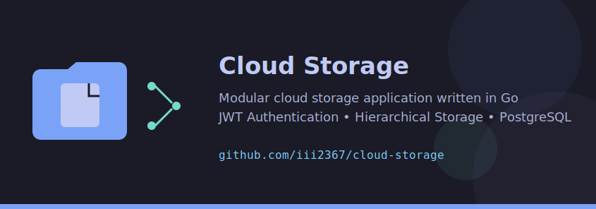

# Hi there 👋 I'm  Oleksandr

**Software Engineer** focused on building maintainable, scalable, and extensible software.

I primarily build backend services with **Go** and native applications with **C++**. I'm particularly interested in software architecture, modular design, and building systems that remain easy to evolve as requirements grow.

---

## About Me

* 🏗️ Software Engineering student
* ⚙️ Building backend services with Go
* 💻 Developing native desktop applications in C++
* 🗄️ Working with PostgreSQL and SQLite
* 🐳 Containerizing applications with Docker
* 🎯 Exploring software architecture, distributed systems, and rendering technologies
  
---

## Tech Stack

### Languages 

### Tools

---

## Engineering Philosophy

I believe software should remain easy to evolve as requirements change.

When designing systems, I focus on:

- Maintainable architecture
- Clear domain boundaries
- Loose coupling
- Extensibility
- Pragmatic use of event-driven architecture

**Architectural styles**

Hexagonal Architecture • Clean Architecture • Event-Driven Design

**Design principles**

SOLID • DRY • KISS • YAGNI

---

## GitHub Stats

---

## Contact

 
 

